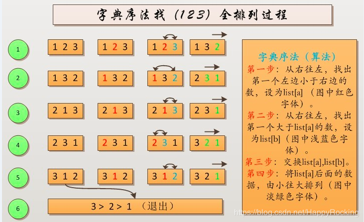

# 1. 问题
实现获取下一个排列的函数，算法需要将给定数字序列重新排列成字典序中下一个更大的排列。

如果不存在下一个更大的排列，则将数字重新排列成最小的排列（即升序排列）。

必须原地修改，只允许使用额外常数空间。

以下是一些例子，输入位于左侧列，其相应输出位于右侧列。
```
1,2,3 → 1,3,2
3,2,1 → 1,2,3
1,1,5 → 1,5,1
```
# 2. 分析
“下一个排列”的定义是：给定数字序列的字典序中下一个更大的排列。如果不存在下一个更大的排列，则将数字重新排列成最小的排列（即升序排列）。

字典序：就是按照字典中出现的先后顺序进行排序。




# 3. 题解

```C++
class Solution{
public:
     void nextPermutation(vector<int>& nums) {
         int i = nums.size() - 2;
         while(i >=0 && nums[i + 1] <= nums[i]){
             i--;
         }
         if(i >= 0){
             int j = nums.size() - 1;
             while(j >= 0 && nums[j] <=nums[i]){
                 j--;
             }
             swap(nums, i, j);
         }
         reverse(nums, i + 1);
     }
     void reverse(vector<int>& nums, int start){
         int i = start, j = nums.size() - 1;
         while(i < j){
             swap(nums, i, j);
             i++;
             j--;
         }
     }
     void swap(vector<int>& nums, int i, int j){
         int temp = nums[i];
         nums[i] = nums[j];
         nums[j] = temp;
     }
}
```